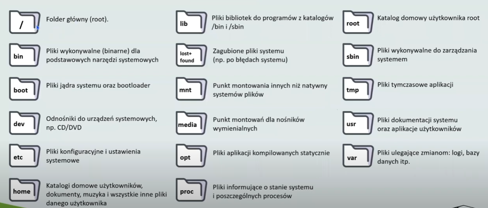
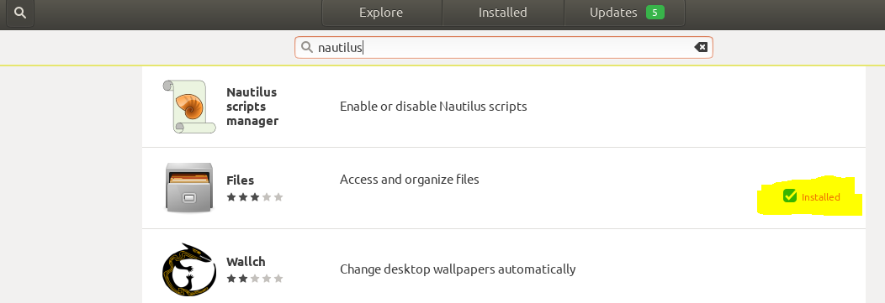
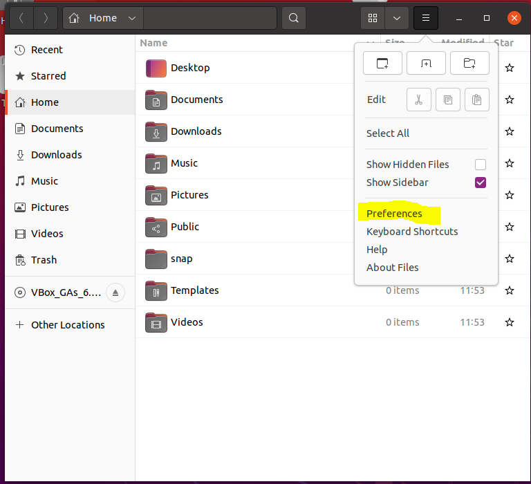
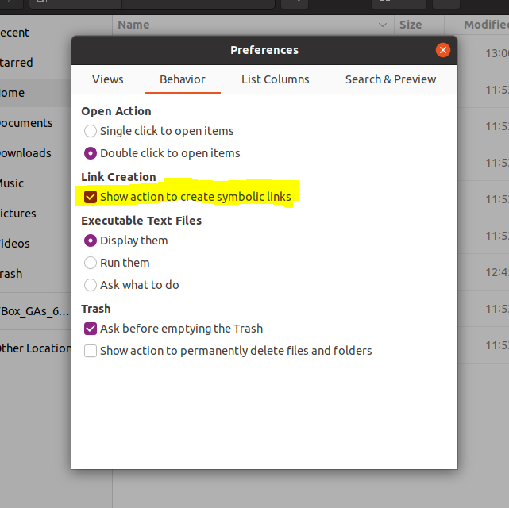
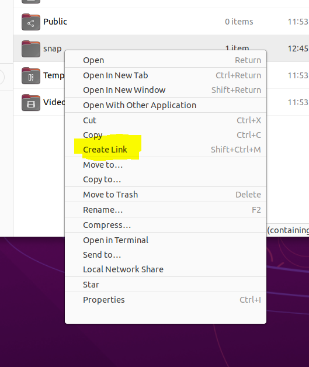
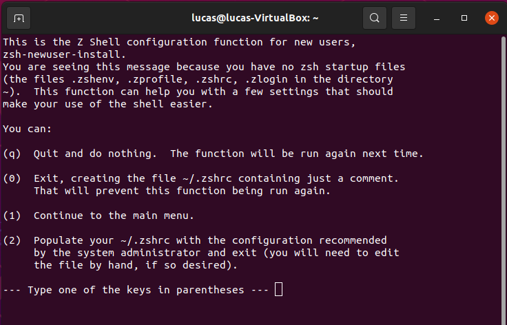
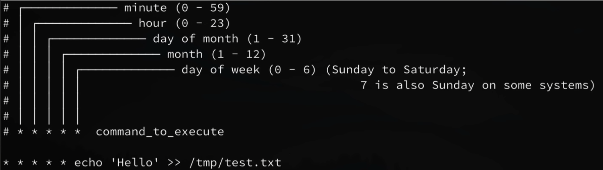
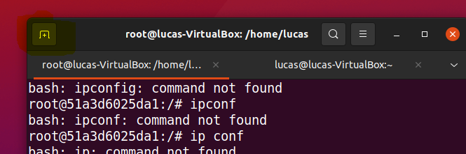

# Linux

## Podstawowe pojecia

PID-process identifier : PID is a unique number that identifies each running processes in an operating system).

## Architektura Linuxa

### System plików




-   linux ma wyróżniony jeden nadrzedny folder zwany 'root' czego nie ma Windows.

-   / oznacza katalog root \~ oznacza katalog home ,  . oznacza katalog bieżący .. oznacza katalog nadrzedny

-   w katalogu /var/log/ są logi linuksowe

-   w pliku /etc/apt/souces.list  - sa mirrory na ktorych sa aplikacje ktore mozemy zainstalowac komenda 'apt-get'

## Make file

Prosty przyklad: [makefiletutorial](https://makefiletutorial.com/), [link](https://opensource.com/article/18/8/what-how-makefile)

## Repozytoria

[link](https://itsfoss.com/ppa-guide/)

## Dostepy / Uzytkownicy

[youtube](https://www.youtube.com/watch?v=jwnvKOjmtEA&t=255s)

### Polecenia

Jak nazywa sie uzytkownik na ktorym jestem zalogowany:

`whoami`

Lista uzytownikow w systemie

`cat /etc/passwd`

Zmiana uzytkownika ktory jest rootem

`sudo su  #  (su od switch user)`

Zmiana na uzytkownika 'lucas'

`sudo su lucas`

Dodaj uzytkownika 'barbara'

`adduser barbara # jest jeszcze polecenie 'useradd', ale niezalecane bo daje mniej mozliwosci`

lista grup do ktorych nalezy aktualnie zalogowany uzytkownik

`groups  # domyslnie chyba dla kazdego usera jest tworzona grupa o jego nazwie.`

lista wszystkich czlonkow danej grupy.

`getent group lucas`

lista wszystkich grup w systemie

`less /etc/group`

Uzytkownicy - informacje

#### sudo su

To explain this you need to know what the programs do:

-   `su` - The command `su` is used to switch to another user (**s** witch **u** ser), but you can also switch to the root user by invoking the command with no parameter. `su` asks you for the password of the user to switch, after typing the password you switched to the user's environment.

-   `sudo` - `sudo` is meant to run a single command with root privileges. But unlike `su` it prompts you for the password of the current user. This user must be in the sudoers file (or a group that is in the sudoers file). By default, Ubuntu "remembers" your password for 15 minutes, so that you don't have to type your password every time.

-   `bash` - A text-interface to interact with the computer. It's important to understand the difference between login, non-login, interactive and non-interactive shells:

Types of shells:

-   **login shell**: A login shell logs you into the system as a specified user, necessary for this is a username and password. When you hit ctrl+alt+F1 to login into a virtual terminal you get after successful login a login shell.

-   **non-login shell**: A shell that is executed without logging in, necessary for this is a currently logged-in user. When you open a graphic terminal in gnome it is a non-login shell.

-   **interactive shell**: A shell (login or non-login) where you can interactively type or interrupt commands. For example a gnome terminal.

-   **non-interactive shell**: A (sub)shell that is probably run from an automated process. You will see neither input nor output.

So the cases are:

-   **`sudo su`** Calls `sudo` with the command `su`. Bash is called as interactive non-login shell. So bash only executes `.bashrc`. You can see that after switching to root you are still in the same directory:

        user@host:~$ sudo su
        root@host:/home/user#

-   **`sudo su -`** This time it is a login shell, so `/etc/profile`, `.profile` and `.bashrc` are executed and you will find yourself in root's home directory with root's environment.

-   **`sudo -i`** It is nearly the same as `sudo su -` The -i (simulate initial login) option runs the shell specified by the password database entry of the target user as a login shell. This means that login-specific resource files such as `.profile`, `.bashrc` or `.login` will be read and executed by the shell.

-   **`sudo /bin/bash`** This means that you call `sudo` with the command `/bin/bash`. `/bin/bash` is started as non-login shell so all the dot-files are not executed, but bash itself reads `.bashrc` of the calling user. Your environment stays the same. Your home will not be root's home. So you are root, but in the environment of the calling user.

-   **`sudo -s`** reads the `$SHELL` variable and executes the content. If `$SHELL` contains `/bin/bash` it invokes `sudo /bin/bash` (see above).

### Plik shadow - zarzadzanie

Praca z tym plikiem jest potrzebne np. w sytuacji kiedy chcemy komuś zmienic haslo.

[link](https://www.cyberciti.biz/faq/understanding-etcshadow-file/)

### **Admin vs Root user vs Super User**

Root user = Super User

Actually the Admin user does not have root privileges. The "root" user has full access to everything and anything in the OS X system including System files and user accounts. The Admin user does not have access to the System files or the files in other user accounts than his/her own. In order to have "root" user access you must first enable the "root user" password, which is done using the NetInfo Manager. In Unix the "root" user is also referred to as the "superuser."

## Screens

screen command in Linux provides the ability to launch and *use multiple shell sessions from a single ssh session*. When a process is started with 'screen', the process can be detached from session & then can reattach the session at a later time. When the session is detached, the process that was originally started from the screen is still running and managed by the screen itself. The process can then re-attach the session at a later time, and the terminals are still there, the way it was left. Poza powyższym zastosowaniem (zdalna obsługa wielu sesji), screen mozna tez uzyc do rozwiazania problemu zwiazanego z tym, ze jezeli rozlaczymy sie z serwerem linuxowym to nasze sesja się przerwie i nasze procesy przestana dzialac. Tworzac screena mozemy latwo rozwiazac ten problem ([link](https://unix.stackexchange.com/questions/479/keep-processes-running-after-ssh-session-disconnects))

     # lista screenow
    Screen -ls   #(jezeli jakis screen ma status ‘attach’ to znaczy ze gdzie jest otwarte okno w ktorym mozna na nim pracowac)

    # tworzenie nowego screenu
    Screen -S <name>

    # sprawdzanie czy jestem w sesji : https://www.ostechnix.com/how-to-check-if-you-are-in-screen-session-or-not-in-linux/
    echo $STY # sprawdzenie czy mój ekran jest w jakiejś sesji (jeżeli nie, to nie zwróci nic)

    # wychodzenie z screenu bez jego zamykania (deatching) : 
    ‘Ctrl+a’ i po chwili naciskam ‘d’

    # wychodzenie z screenu z zamykaniem (killing) : Ctrl+a’ i po chwili naciska ‘k’. Potem jeszcze zatwierdzam przez ‘y’

    # zamykanie screen (quit):
    screen -S PID -X quit

    # zamykanie screen (kill):
    screen -X -S SCREENID kill


    #wchodzenie do sesji
    screen -r <numer>

    # usuwanie martwych screenow
    screen -wipe

    # usuwanie konkretnego matwego screena
    screen -wipe PID   

## Red Hat

## Ubuntu

### Instalacja

#### Virtual Box na Windows 10

filmik: instalacja plus rozwiazanie problemu malego okna (przetestowane na Ubuntu 21.04): [link](https://www.youtube.com/watch?v=x5MhydijWmc)

### Nautilus

#### Creating links

Sprawdzam czy Nautilus jest zainstalowany (wystepuje pod nazwa "Files"):



Uruchamiam Nautilusa i przechodze do jego *Preferences*.



W *Preferences* zaznaczam opcje umozlwiajaca dostep do tworzenia linkow w menu kontekstowym. :



Teraz w Nautilusie w menu konteksowym pliku/folderu mamy mozliwosc tworzenia linkow:



Taki link po utworzeniu np. metoda "Drag and drop" moge sobie przerzucic na pulpit.

## Terminal-Shell-console

Domyslnie jako shell funkcjonuje *bash*. Ale są alternatywny. Najbardziej popularną jest *zsh* który ma liczne pluginy pozwalajace go bogato skonfigurowac.

### ZSH Instalacja i konfiguracja

Instalacja : [youtube](https://www.youtube.com/watch?v=tUkIHhdxnyM)

krok 1:

zaktualizowanie listy dostepnych pakietow

`sudo apt-get update`

krok 2:

instalacja:

`sudo apt-get install zsh`

krok 3:

Konfiguracja. Tutaj tez zostanie utworzony plik konfiguracyjny

Wpisujemy:

`zsh`

i dostajemy:



Uwaga o lokalizacji pliku konfiguracyjnego:

Przy domyslnym ustawieniu sciezki utworzonego pliku konfiguracyjnego `~/.zshrs` plik utworzy się w katalogu `home/<nazwa_uzytkownika>/`

Poniewaz nazwa pliku zaczyna sie od kropki, bedzie to plik ukryty.

krok 4:

Ustawienie *zsh* jako domyslnej powloki.

Po zaintalowaniu *zsh* nie staje sie on automatycznie domyslna powloka. Mozemy to sprawdzic wpisujac:

`echo $SHELL`

zwroci nam ze domyslnie dalej uzywamy *bash*:

/bin/bash Zeby dokonac zmiany:

`chsh -s /usr/bin/zsh` \# . Zakladam ze *zsh* jest w sciezce `/usr/bin/`. Nazwa komendy *chsh* jest od 'change shell'

Nastepnie musze sie wylogowa i zalogowa do ubuntu (nie wystarczy nowa sesja w terminalu).

krok 5:

Opcjonalne instalacja *oh-my-zsh*

Musimy miec zainstalowanego *Git*. Mozemy sprawdzic czy go mamy np. poprzez:

`apt-cache policy git`

Jezeli go nie mamy to go instalujemy:

`sudo apt install git-all`

Dalej instalujemy *oh-my-zsh*:

`sh -c "$(wget https://raw.github.com/ohmyzsh/ohmyzsh/master/tools/install.sh -O -)"` Po wykonaniu powyzszej komendy bedzie od razu aktywny.

krok 6:

Uzywanie plugins: [link](https://linuxhint.com/use-zsh-plugins/)

Lista dostepnych pluginow jest tutaj: [link](https://github.com/ohmyzsh/ohmyzsh/wiki/Plugins)

Kazdy plug in ma swoja instrukcje instalacji. Jezeli mamy zainstalowany *oh-my-sh* to mozemy korzystac z intrukcji istalacji dedykowanej wlasnie pod niego.

Naciekawsze pluginy:

[**zsh-autosuggestions**](https://github.com/zsh-users/zsh-autosuggestions) **-** podpowiedz skladni

[**zsh-syntax-highlighting**](https://github.com/zsh-users/zsh-syntax-highlighting) **-** podkreslanie skladni

### Skladnia

Super sciaga (rowniez do pisania skryptow do plikow sh): [devhints](https://devhints.io/bash).

#### Ogólne zasady

##### `#!`

##### When the first characters in a script are `#!`, that is called the [shebang](http://en.wikipedia.org/wiki/Shebang_%28Unix%29). If your file starts with `#!/path/to/something` the standard is to run `something` and pass the rest of the file to that program as an input.

##### 

| `$#` |                            Number of arguments |
|:-----|-----------------------------------------------:|
| `$*` |    All positional arguments (as a single word) |
| `$@` | All positional arguments (as separate strings) |
| `$1` |                                 First argument |
| `$_` |          Last argument of the previous command |

shift:

`shift` is a `bash` built-in which kind of removes arguments from the beginning of the argument list. Given that the 3 arguments provided to the script are available in `$1`, `$2`, `$3`, then a call to `shift` will make `$2` the new `$1`. A `shift 2` will shift by two making new `$1` the old `$3`. For more information, see here:

**Uruchamienie skrypty sh**

`bash nazwa_skryptu`

lub

`sh nazwa skryptu`

##### Vertical bar \|

The vertical bar character is used to represent a [*pipe*](http://www.linfo.org/pipe.html) in [commands](http://www.linfo.org/command.html) in [Linux](http://www.linfo.org/linuxdef.html) and other [Unix-like](http://www.linfo.org/unix-like.html) [operating systems](http://www.linfo.org/operating_system.html). A pipe is a form of [*redirection*](http://www.linfo.org/redirection.html) that is used to send the output of one [program](http://www.linfo.org/program.html) to another program for further processing.

##### colon (dwukropek)

[link](https://stackoverflow.com/questions/3224878/what-is-the-purpose-of-the-colon-gnu-bash-builtin)

[link](https://www.aplawrence.com/Basics/leading-colon.html)

##### brace expansion

[link](https://linuxhint.com/bash_brace_expansion/)

Używanie && i II

[link](https://stackoverflow.com/questions/4510640/what-is-the-purpose-of-in-a-shell-command)

##### list vs array

[link](https://www.usessionbuddy.com/post/What-Is-List-And-Arrays-In-Bash/)

##### Nawiasy

[link](https://unix.stackexchange.com/questions/306111/what-is-the-difference-between-the-bash-operators-vs-vs-vs)

-   podwojne okrągłe nawiasy sa uzywane glownie do obliczen arytmetycznych:

((sum = 5 + 3))\

-   do flow control:

for ((i = 10; i \>= 1; i--)); do

  echo \$i

done

while ((i \<= 10)); do

  ((sum += i))

  ((i++))

done

#### Przykłady

Co to robi: \${2:-\${1}}

It means "Use the second argument if the first is undefined *or* empty, else use the first". The form "\${2-\${1}}" (no ':') means "Use the second if the first is not defined (but if the first is defined as empty, use it)".

    $x -le 5    mniejsze niz 5
    $x -gt 5    wieksze niz 5
    $x -eq 5    rowne 5

    &&   and

#### Skroty oznaczenia

\^*X* - Ctrl + X

#### Zmienne

Mamy 2 rodzaje zmiennych:

-   **Environment variables (zmienne środowiskowe)** are variables that are available system-wide and are inherited by all spawned child processes and shells.

-   **Shell variables** are variables that apply only to the current shell instance. Each shell such as `zsh` and `bash`, has its own set of internal shell variables.\

Uzywanie zmiennych srodowiskowych : [link](https://linuxize.com/post/how-to-set-and-list-environment-variables-in-linux/)

**Typy zmiennych (int, string itp):**

[link](https://tldp.org/LDP/abs/html/untyped.html) - generalnie nie ma typów w bash

ale można je wymuszać: [link](https://tldp.org/LDP/abs/html/declareref.html)

**Używanie cudzysłowia przy zmiennych**

[link](https://tldp.org/LDP/abs/html/quotingvar.html)

    List="one two three"

    for a in $List     # Splits the variable in parts at whitespace.
    do
      echo "$a"
    done
    # one
    # two
    # three

    echo "---"

    for a in "$List"   # Preserves whitespace in a single variable.
    do #     ^     ^
      echo "$a"
    done
    # one two three

#### Nawiasy

[link](https://ss64.com/bash/syntax-brackets.html)

#### Special character

[link](https://tldp.org/LDP/abs/html/special-chars.html)

#### Strumienie (**stdin, stdout and stderr)**

Strumienie dzieli się na wejściowe (stdin) np. wprowadzenie hasła i na strumienie wyjściowe (stdout i stderr dla errorów)

[link](https://linuxhint.com/bash_stdin_stderr_stdout/)/

[<https://linuxhint.com/bash_stdin_stderr_stdout/>](https://linuxhint.com/bash_stdin_stderr_stdout/){.uri}

strumienie mozna przekierowywac:

ls -l  \> list.txt

xargs służy do przekierowania strumienia do funkcji w postaci argumentów np:

    find /path -type f -print0 | xargs -0 rm

    echo 'one two three' | xargs mkdir

    echo 'one two three' | xargs -t rm     

### Komendy bash

Lista 37 najwazniejszych komand z opiesem: [link](https://www.howtogeek.com/412055/37-important-linux-commands-you-should-know/) (brakuje na liscie cp)

Lista pelna komend: [link](https://ss64.com/bash/)

#### cat

#### chmod

[link](https://www.howtogeek.com/437958/how-to-use-the-chmod-command-on-linux/)

chmod 777: [link](https://linuxize.com/post/what-does-chmod-777-mean/)

#### rm

rm vs rmdir:

You can also use the rm command to delete directories by using the -r option alongside the command. So what is the basic difference between both the commands? Well, the answer is simple. The rm command can be used to delete non-empty directories as well but rmdir command is used to delete only empty directories. There is absolutely no way to delete non-empty directories using the rmdir command.

#### tar

[link](https://www.tecmint.com/18-tar-command-examples-in-linux/)

tar scala katalog z plikami w jeden plik z rozszerzniem 'tar' służący do archwizacji. Sam tar nie robi kompresji. Jażeli chcemy za jednym zamachem zrobić plik 'tar' i go spakować to używamy polecenia gzip.

#### let

[link](https://www.computerhope.com/unix/bash/let.htm)

Using **let** is similar to enclosing an arithmetic expression in double parentheses, for instance:

    (( expr ))

#### apt

apt list apt list \| grep nginx

apt list--installed

#### source

odpalanie skryptu bash np:

    source /path/to/script

## Networking

### polecenie netstat

<https://www.tecmint.com/20-netstat-commands-for-linux-network-management/>

Sprawdzenie socketow

```{r}
# przyklad dla portu majacego w nazwie ':80'. dzieki 'p' bedzie wyswietlony PID procesu. 
sudo netstat -nlp |grep :80

```

## Scheduling

W linuxie sluzy do tego cron.

```{r}

# czy sa jakies zaplanowane zadania dla aktualnego uzytkownika:
crontab -l


# edycja pliku domyslnie ustawionym w linuxie edytorem
crontab -e


```



Na powyzszym obrazie poszczegolne gwiazdki (rozdzielone spacje) odpowiadaja poszczegolnym jednostka czasu, co jest zmapowane liniami.

Przyklady skladni:

```{r}

# Przykad sladni dla jednoska= minuta

# kazda minuta
* * * * * echo 'Hello' >>/temp/test/txt

#minuty od 0 do 5
0-5 * * * * echo 'Hello' >>/temp/test/txt

# minuty 1,10,15,20 
1,10,15,20 * * * * echo 'Hello' >>/temp/test/txt

# co dziesiata minuta (tutaj minut)
*/10 * * * * echo 'Hello' >>/temp/test/txt

```

W samym pliku warto dodawac komentarze (po znaku '\#')

Rozne przyklady:

```{r}

# EMpty temp folder every FRoday at 5pm
0 5 * * 5 rm -rf /tmp/*
  
# backup images to Google DRove every night at midnight


```

## Rozne

Windows Device Manager equivalent

`sudo apt install hardinfo`

`hardinfo`

### 

### Uzywanie dev/null

<https://linuxhint.com/what_is_dev_null/>

<https://www.journaldev.com/35489/dev-null-in-linux>

pushd w polaczeniu z dev/null: [link](https://serverfault.com/questions/108154/can-i-call-pushd-popd-and-prevent-it-printing-the-stack)

The standard error can be redirected to both /dev/null and the errorfile.txt file using the following command:

\$ pirntf "%s\\n" "Hello" 2\> /dev/null \> errorfile.txt

### Exit status

<https://www.cyberciti.biz/faq/bash-get-exit-code-of-command/>

### sh vs source vs bin

<https://stackoverflow.com/questions/13786499/what-is-the-difference-between-using-sh-and-source>

### Domyslny edytor

Przyklad zmiany na edytor *nano*.

`export EDITOR=/usr/bin/nano`

### Split okna terminala

W lewym gornym rogu jest krzyzyk ktory otworzy nowe okno poprzez split ekranu.



### vim

wyjscie z programu:

najpierw przyciskiem ESC trzeba wejsc w tryb wydawania koment i potem:

-   :q -- wyjście

-   :q! -- wyjście z odrzuceniem zmian

-   :wq -- wyjście z zapisaniem

-   :w -- zapis

-   :qa -- zamknięcie wszystkich plików

    UWAGA: pamiętać o dwukropku na początku wydawanej komedy!
