# Virtualisation

## Virtual Machines

## Virtual OS - Kubernetes

### Instalacja

#### Windows

Pobieramy i instalujemy instalkę z minikube.

Pobieramy kubectl. Tworzymy katalog c:\\`kube` do ktorego wklejamy instalke kubectl. W zmiennych srodowiskowych w zmiennych systemowych do Path dodajemy ta sciezke.

Aplikacje uruchamiany w Power Shell (uruchominy w trybie administracyjnym) poleceniem `minikube start`

#### Ubunt

To Do.

### Pytania

O co chodzi z plikami konfiguracyjnymi pod pod. Przeciez powinnismy pracowac tylko na warstwie Deployment/StatefulSet, a mimo to pods sie pojawialy (np w przykladzie przy konfiguracji Volumens pod pods). Pods maja chyba dynamicznie nadawane nazwy (przynajmniej te stateless) z hashami. Jak się do takich nazw odwolywac w tych plikach? Pods maja tez dynamiczne adresy IP, ale ten problem rozwiazuje Services.

Jak wyglada komunikacja sieciowa (nie przez Volume) miedzy contenerami w pod? Chyba jest jakies rozwiazanie provider-consumer, bo same kontenery nie maja adresu IP (ma je pod). Nie wiem czy poza Volumes da sie (albo czy jest zalecane) komunikowanie sie kotenerow miedzy roznymi pod-ami (np. sieciowo). Chyba sie da poprzez Services (patrz podrozdzial o Services).

Komunikacja miedzy kontenerami: [link](https://www.mirantis.com/blog/multi-container-pods-and-container-communication-in-kubernetes/)

What is **kunernetes context** : A kubernetes context is **just a set of access parameters that contains a Kubernetes cluster, a user, and a namespace**. kubernetes Context is essentially the configuration that you use to access a particular cluster & namespace with a user account

What is **Job**: A Job creates one or more Pods and will continue to retry execution of the Pods until a specified number of them successfully terminate. As pods successfully complete, the Job tracks the successful completions. When a specified number of successful completions is reached, the task (ie, Job) is complete. Deleting a Job will clean up the Pods it created. Suspending a Job will delete its active Pods until the Job is resumed again.

### Rozne uwagi

-   Kubernetes moze miec pod soba rozne rozwiazania kontenerowe. Wiec nie koniecznie musi to byc Docker.

-   Na kontenerach jest budowana dodatkowo Kubernetosewa warstwa *Pod*. Umożliwia ona abstrakcje kontenerow. Dzieki temu pracujac z kontenerami mozemy byc caly czas w warstwach Kubernetesa nie schodzac do samych kontenerow. Tak naprawdę w praktyce nie schodzi się nawet do warstwy *pod*, ale pracuje z poziomem *Deployment*. Teoretycznie jeden *pod* moze miec pod soba kilka kontenerow, ale sie rzadko sie tego uzywa.

-   Kubernetes obsuguje *Volume* ktore tak jak przy dockerach sluza do przechywywania w sposob trwaly informacji. Kubernetes domyslnie nie zarzadza Volumnes. Volumes moga byc lokalnie w klastrze (ktorys z Nodow), albo byc zdalne. W obu przypadkach sa one plug-inem do calego Kubernetesa i znajduja sie poza samym Kuberneteresm. W przypadku baz danych zaleca sie aby byly one zdalne. Po pierwsze nasz *VOlumne* jest niezalezy od problemow z Nodami, a po drugie nie jest zwiazany z konkretnym Nodem (to chyba generuje np. utrudnienie w konfigurowaniu polaczen do Volume). Dodatkowo wystepuja jeszcze volumes wewnatrz pod-a do komunikacji miedzy kontenerami. Ale te volume zyja tak dluzo jak zyje *pod*.

-   Ingress - Interfejs zewnetrzny umozliwiajacy komunikacje aplikacji ze swiatem zewnetrznym. Mozna to pominac poprzed odpowiednio skonfigurowane Service, ale jest to rozwiazanie zalecane.

-   Services - wiece - patrz podrozdzial o tym temacie.

-   ConfigMap - trzyma rozne konfiguracje. Jezeli cos zmieniamy w calym systemie, to zamiast robic to na poziomie poszczegolnych kontenerow, mozna tym zarzadzac przez taki plik. Technicznie jest to szczegolny przypadek Volume.

-   Secret. -Taki ConfigMap, ale uzywany do przechowywanie hasel i innych poufnych informacji. Technicznie jest to szczegolny przypadek Volume.

-   Deployment - Replikacje i wiele innych rzeczy związanych z zarządzaniem robi się nie ręcznie, ale przez Deplyment. Uwaga. Przez Deployment nie mozna duplikowac baz danych. Duplikaty baz korzystaja z tych samych *Volumes* i trzeba zapewnic ze zapisy z roznych duplikatow baz nie doprowadza do niezgodnosci w danych. Do tego uzywa sie Statefulset. Poza *Deployment* jest jeszcze warstwa *replicaset* ktora jest pod nia, ale jest powyzej warstwy *pod*. Sluzy do zarzadzania replikami pod-ow. Zarzadzmy ta warstwa z poziomu *deployment*.

-   Statefulset - Przez Deployment nie mozna duplikowac baz danych. Duplikaty baz korzystaja z tych samych *Volumes* i trzeba zapewnic ze zapisy z roznych duplikatow baz nie doprowadza do niezgodnosci w danych. Do tego uzywa sie Statefulset.

### Architektura

Mamy *master node* i *workes nodes*.

Na kazdym *worker node* musza byc zainstalowane 3 komponenty:

-   Container runtime - narzedzie do uruchamiania kontenerow (np. Docker Engine)

-   Kublet - interfejs Kubernetersa do wspolpracy z Container runtime i z samym nodem.

-   Kube proxy. Narzedzie do optymalizacji pracy pod katem przeplywu informacji. Chodzi o to zeby minimalizowac ruch sieciowy. Np. jezeli dwa kontenery (a wlasciwie pod-y) musza sie ze soba skomunikować to niech to bedzie w ramach tego samego Noda jezeli to jest mozliwe. Kube proxy umozliwia rozniez komunikacje *pod-ow* ze swiatem zewnetrznym

Na *master node* mamy 4 komponenty:

-   API Server - interfejs dla użytkownika do zarzadzania interfejsem. Rowniez waliduje request-y uzytkownikow.

-   Scheduler - Np. jezeli chcemy utworzyc nowy Pod, to po weryfikacji naszego requesta przez API Server, to scheduler zadecyduje na jakim node go utworzyc. Zbada gdzie sa odpowiednie zasoby dla naszej aplikacji. (po wybraniu lokalizacji samego *pod-a* zalozy nam na nadzie Kublet)

-   Controller Manager - wykrywa stany *pod-ow* (np. ich zawieszenie się, albo wywalenie się). Jezeli jest problem (np. *pod* sie zawiesi) to *Controller Manager* sprobuje go zrestartowac. W celu optymalizacji wspolpracuje ze *schedulerem*, ktory samo zadanie (czyli np. restart *pod-a*) zleca *Kublet-owi*.

-   etcs - klucze z zapisanymi informacjami o stanie klastra Kubernetesowego. Czyli wszystkie operacje klustra (glownie zwiazane z *pod*) sa tu rejestrowane. *Scheduler* i *Controller Manager*\* korzystaja z niego. Na jest podstawie wiedza co gdzie jest na nod-ach.

Siec - jest jedna na caly cluster:

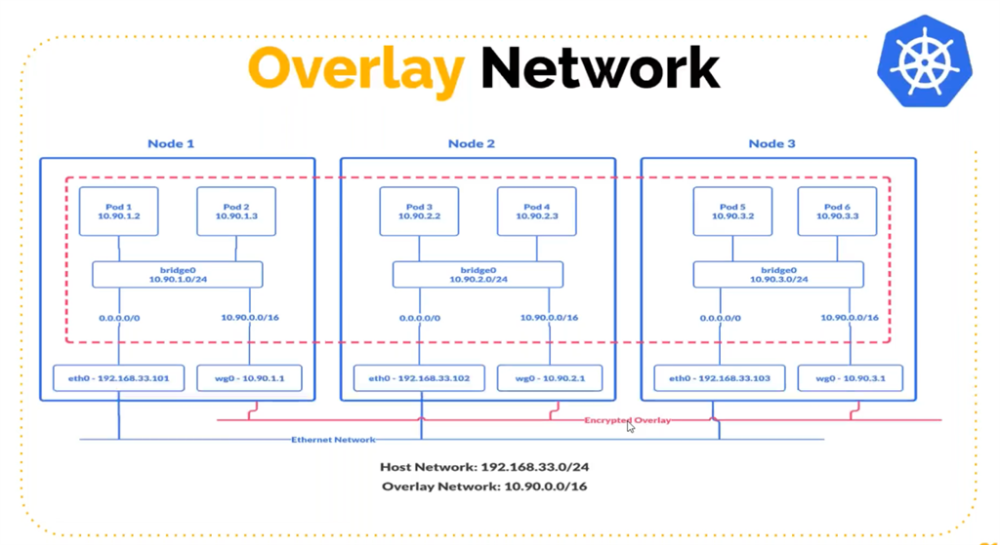

Podsumowanie architektury:

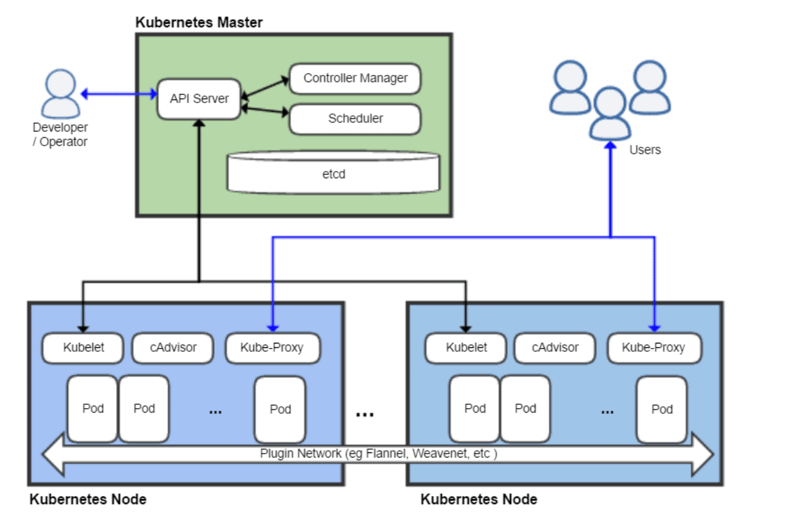

Przyklad architektury z Mongo DB (baza) i Mongo Express (jako UI):

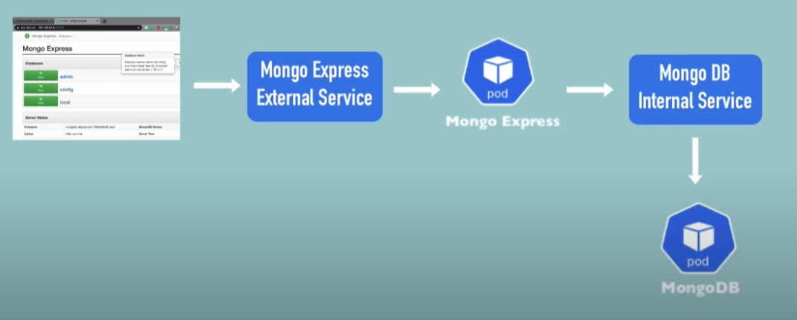

Narzedzie do laczenia sie z API server:

-   ctl - interfejs konsolowy - najbardziej profesjonalne narzedzie

-   ui - klikany interfejs

-   api -

#### **Podzial pod-ow na aplikacje stateful i stateless**

-   sateful pods - potrzebuje zapisywania informacji o swoich stanach rzeczy sie do nich potem odwolywac. Przykladem jest baza danych. W Kubernetes sa obslugiwane przez *Deployment.* Nie mylic ich z Volumes.

-   stateless pods - nie musza zapisywac inforamcji o swoim stanie ich pamietac. W Kubernetes sa obslugiwane przez *StatefulSet.*

Dla sateful jest duzo trudniej robie replikacje, bo sa dodatkowe wymagania. Tutaj kazdy replikowany pod ma swoj oddzielny identyfikator.

W stateless pods mamy podzial na mastera i workerow:

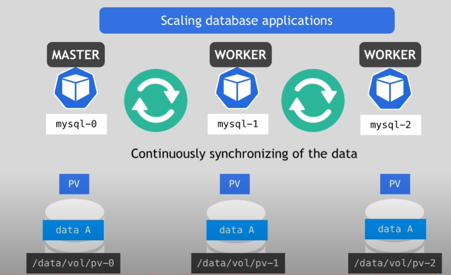

Kazdy element ma swoje oddzielne pv (volumne). Kiedy nastepuje zmiana w danych na Master , to wtedy obowiazkiem Workerow jest synchronizacja danych z Masterem tak aby wszedzie byly te same dane.

Uwaga. Volumnes nie sa obowiazkowe, ale robienie bazy bez Volumes nie ma sensu. W komencie restartu pod-a utracimy dane.

Nazewnicto dla stateful pods to nie sa losowe hashe (jak w statless), ale narastajace numery.

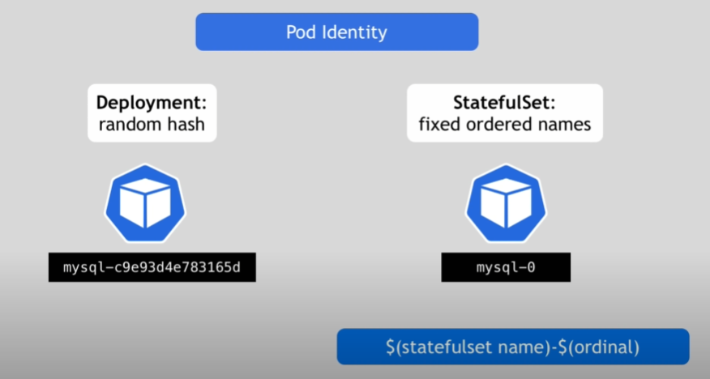

numer 0 (zero) to zawsze master. Kolejny workes jest tworzony na podstawie poprzedniedo (np. 3 odwoluje sie do 2). Jak usuwamy np. 3 to wczesniej musimy usunac wyzsze numery ( w kolejnosci od najwyzszego numeru).

Nazwy pod-to dla stateful sa tez stale (dla stateles przy restarcie pod-a hash jest chyba generowany na nowo). Dzieli czemu po restarcie nod-a mozna np. latwo przywrocic jego podpiecie do pv (hmm, stateless nie ma sztywnego polaczenia z pv?)

Kuberneter dosys slabo wspiera te wszyskie procesy zwiazane z stateful. Np. synchronizacje danych musimy sobie sami ogarnac.

### Polecenia

```{r}

# minikube status
minikube status


# wersja  kubernetesa
kubectl vesion 


# lista wszystkich komponentow
kubectl get all


# lista nod-ow
kubectl get nodes


# lista pod-ow
kubectl get pod
kubectl get pod -o wide # lista z wieksza ioscia informacji

# lista deploymentow
kubectl get deployment


# lista uslug
kubectl get services


# help po komndy tworzoce elementy
kubectl create -h


# tworzenie deploymentow-ow (nie tworzomy pod, ale pracujemy poziom wyzej czyli na poziomie deployment)
kubectl create deployment [deployment_name] --image=[image_name] #
  

# logi z pod-a
kubectl logs [pod_name] # nazwa poda to prefix od deployment plus dodany hash
  
# informacje
kubectl describe pod [pod_name] # tutaj tez mozna zobaczyc jakie sa kontenery z pod
kubectl describe service [sevice_name]
....


# lista services 
kubectl get service

# wejscie do kontenera (nie wiem jak wyglada sytuacja (i skladnia) kiedy pod jednym pod-em jest kilka kontenerow)
kubectl exec -it <pod name> -- bin/bash


# usuniecie deploymentu
kubectl delete deployment <deployment_name>
  
# satysyki ilosc replik pod-ow (ilosc pod-ow mozna ustawic jako opcje przy ich tworzeniu)
kubectl get replicaSet
  
56:03 3282s
```

output kobectl get pod:

```{r}

NAME                          READY   STATUS    RESTARTS   AGE

mongo-depl-5fd6b7d4b4-h6k2j   0/1     .....     0          16m
mongo-depl2-fiksdfb7d4b4-h6   1/1     Running   0          16m


# 0/1 oznacza ze pod zostal utworzony, ale kontener ktory jest pod spodem nie zostal uruchominy. 2/3 - 2 z 3 kontenerow juz dzialaja

```

### Praca z plikami konfiguracyjnymi

Pliki konfiguracyjne są tworzone w YAML lub JSON. Ich budowa pozwala potem latwo odwolywac sie do poszczegolnych elementow w poleceniach (patrz: [link](https://kubernetes.io/docs/reference/kubectl/jsonpath/)).

Glowne typy to:

-   Deployment

-   Service

-   Secret

-   ConfigMap - jezeli kilka usulg bedzie chcilo sie np. odwolac do naszej bazy to dobrze dac jej adres w ConfigMap. Wtedy przy zmienie np. adresu servera zmieniamy tylko raz w konfig map, a nie w kazdyej aplikacji ktora musi miec namiar na baze.

-   Job

-   Ingress

-   Rozne elementy do Volumes

-   I inne

W skladni YAML wazne sa wciecia

Pliki konfiguracyjne powinno sie trzymac z kodem projektu.

Pliki mozna tak naprawde polaczyc w jeden plik. Kolejne komponenty oddzielam w plikach YAML poprzez:

`---`

Do zarzadzania plikami warto uzywac *Helm*.

Po zaladowaniu pliku jest konfigiracja jest zapisywana w Kubernetesie i Kubernetes nie ptrzebuje tych plikow. Konfiguracje mozemy z Kubernetesa mozemy wyswietlic w strukturze YAML, albo nawet wyeksportowac do YAMLA.

Plik konfiguracyjny zawiera

-   kind - np. deployment, service itp. W zaleznosci od *kind* bedziemy miec inne elementy w czesci pliku dot. specyfikacji: 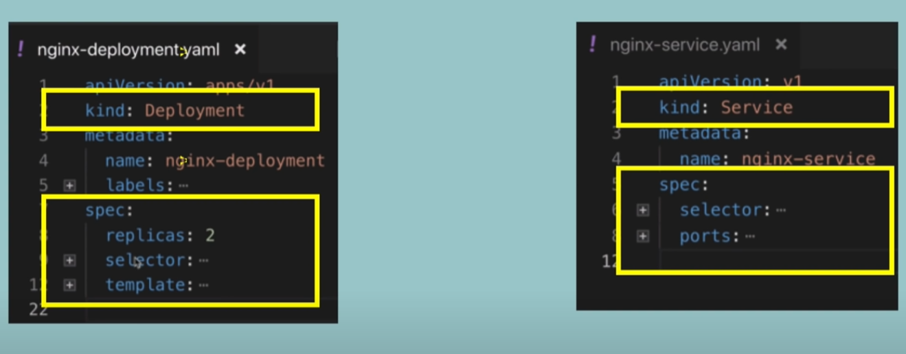

<!-- -->

-   metadane

-   specyfikacje

-   status - Według filmiku jest jeszcze status-jest automatycznie generowany przez Kubernetes. Sprawdza czy to co jest naprawdę, jest zgodne ze specyfikacja. Tak wiec jezeli wszystko jest ok to nie mamy tej czesci w pliku. Jezeli sa problemy to Kubernetes automatycznie doda ta sekcje. Dane o statusie sa pobierane w etcd. Żeby miec konfiguracje uzupelniona o status w formacie pliku to musimy ja sobie wyeksportowac.

```{r}
# wyswietlenie konfiguracji w strukturze yaml
kubectl get deployment [nazwa_deployment] -o yaml

# dodatkowo ekport do pliku
kubectl get deployment [nazwa_deployment] -o yaml > [nazwa_pliku.yaml]
```

#### Labels i Selectors

Labels sa w sekcji 'metadata', a selectors w sekcji 'spec'. Ponizej jest pokazane jak Service jest spinane z deployment poprzez Label i Selector (pamietajmy ze kilka pod-w moze byc pod jednym services).

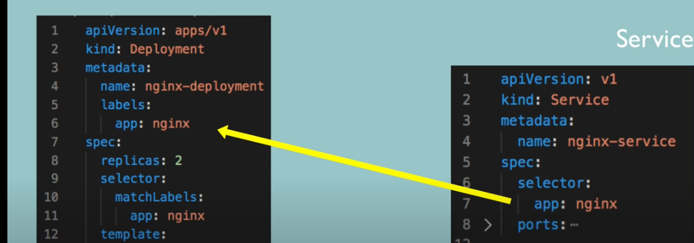

Analigicznie *pod* jest spinany z deployment.

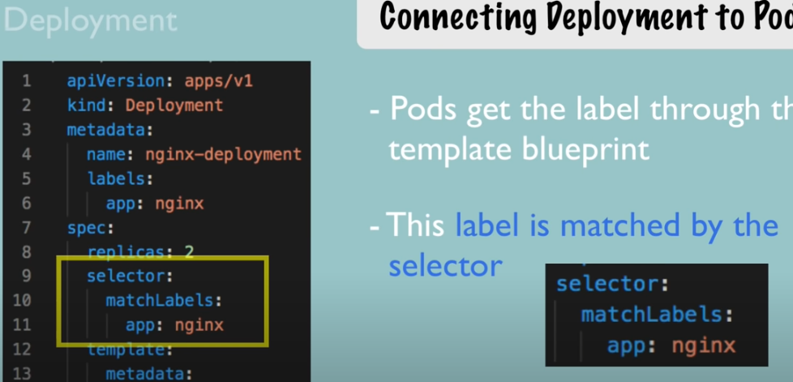

Ponizej sa pokazanie wspolzaleznosci w konfiguracji portow kontenerow i Services:

Kontener nasluchuje na 8080. Service ma port 80, ale pod nia moze byc kilka podow/kontenerow. Wiec trzeba okreslic w Service 'targetPoint' ktory okresla do ktorego kotenera sie odnosimy.

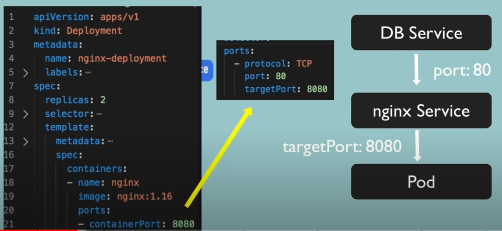

```{r}

# tworzenie pliku konfiguracyjnego (kazdy deployment/service ma swoj)
touch <nazwa_pliku.yaml>

# uruchamianie pliku konfiguracyjnego deploymentu/service
kubectl apply -f [file_name.yaml]
```

#### plik konfiguracyjny - Deployment

Budowa pliku konfiguracyjnego dla *Deployment:*

Szablon dla samego Poda jest na podjasnionym miejscu na rysunku ponizej.

W tym podjasnionym miejscu jest kolejna sekcja 'spec' gdzie definiuje sie takie rzeczy jak obraz pod kontenery, port port itp.

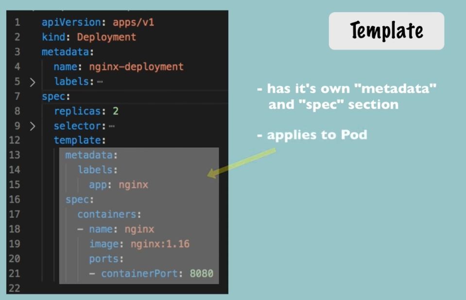

#### plik konfiguracyjny - pod

Chyba tez taki jest bo wystepuje w przykladach.

#### plik konfiguracyjny - Service

typy Service:

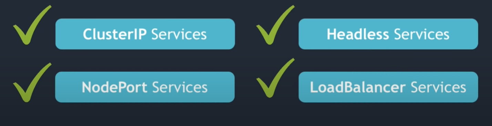

ClusterIP:

-   jest domyslny

-   jest wewnetrzny w tym sensie ze nie wystawia komunikacji poza Kluster Kubernetesa.

-   *pods* maja zmienne adresy IP, natomiast *Service* ma staly adres. Dzieki czemy w komunikacji lepiej odwolywac sie do service ktory na przekieruje na *pod* niz do samych *pod*.

-   Zduplikowane pod-sy sa podpinane automatycznie pod ten sam services (jezeli oczywiscie poda podpielismy pod Service).

-   Uzywa sie ich do podpinania pods z aplikacjami stateless

Headless:

-   Uzywa sie ich do podpinania pods z aplikacjami statefull. W ClusterIP kiedy mamy duplikaty pod podpietych pod to samo ip service , to ten service losowo nas przekierowuje do ktorejs z kopii. Przy aplikacjach sateful nie chcemy tej losowosci. My chcemy laczyc sie z konkretnym pode-m. Pamietajmy ze przy statefull 'kopie' maja indywidualne stale nazwy.

NodePort:

-   Sa przypisane do Nod-a, ale tak jak ClusterIP moga przekierowywac na *pods*.

-   Maja mozliwosc bezposredniej komunikacji ze swiatem zewnetrznym (bez posrednictwa Ingress) co nie jest do konca dobre.

-   W praktyce sie bardzo rzadko je stosuje.

-   Traktuje sie je jako rozwiniecie ClusterIP.

LoadBalancer Services

-   To rozwiniecie NodePort umozliwiajace komunikacje ze swiatem zewnetrznym (bez posrednictwa Ingress) poprzez LoadBalancer.

-   Aby uzyskac ten typ:

    `type:LoadBalancer`

    oraz w portach dodajemy port noda. Port noda w przeciwienstwie do NodePort nie jest wystawiony bezposrednio na zewnatrz.

    `nodePort: [numer]`

    Uwaga: external Service uzywa sie tylko w celach testowych. Żeby wystawic komunikacja na zewnatrz preferuje sie uzycie Ingress.

ClusterIP: Komunikacja z Ingress

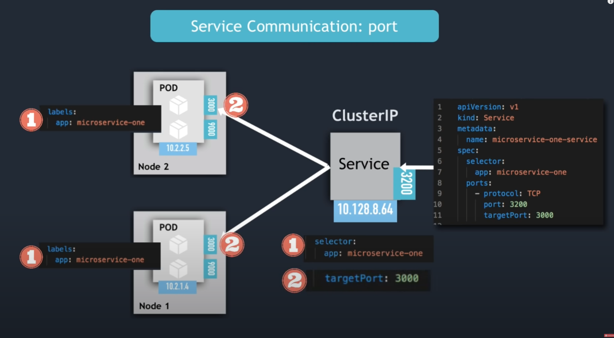

ClusterIP: Komunikacja wewnatrz klastra:

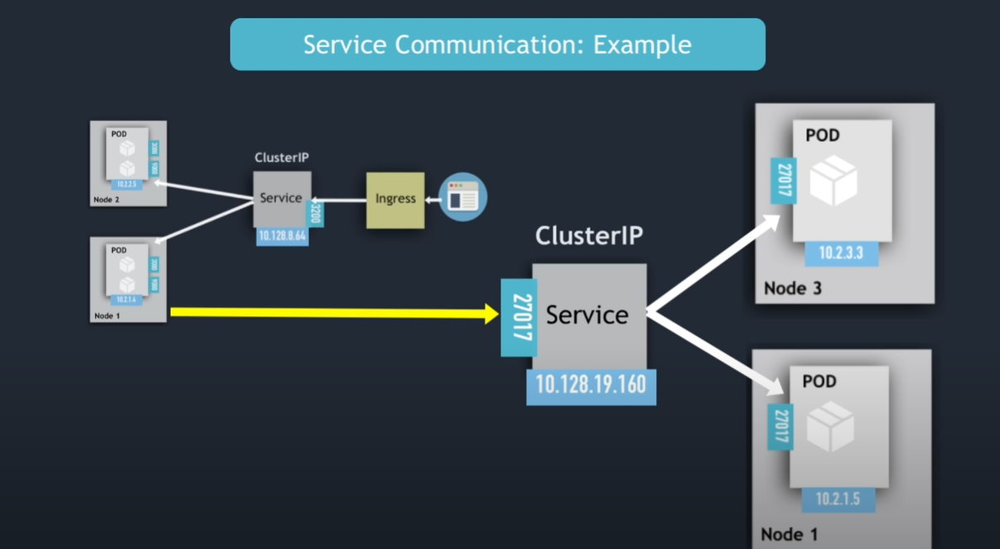

Headless (dla stateful)

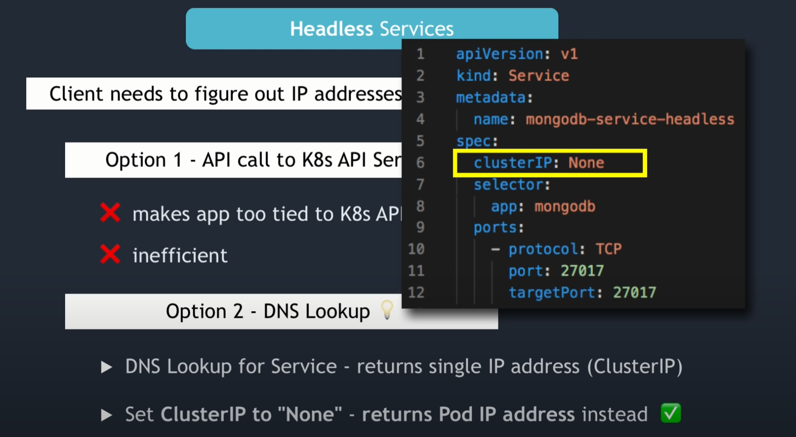

#### plik konfiguracyjny - Secret

```{r}
# w Linux przekodowania tekstu na base64:
echo -n 'text' | base64
```

Odwolanie sie innym pliku (deployment) do zawartosci Secret.

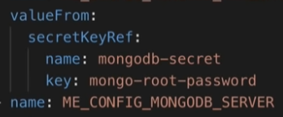

#### plik konfiguracyjny - Ingress

Ingress ma swoje IP ktore jest wystawiona na zewnatrz. Dodatkowo jest ono zmapowane na nazwe DSN. Osoba wpisuje sobie adress http (glowna czesc odpowiadajaca IP Ingress i potem rozne slashe ktore moga odpwiadac roznym pod-om). W Ingress mamy przekirowanie z otrzymanygo http na poszczegolne aplikacje.

W celach testowych Ingressa w linux mozemy sobie zrobic mapowanie w etc/hosts. Wtedy przegladarka przekieruje dana nazwe na IP naszego Ingressa.

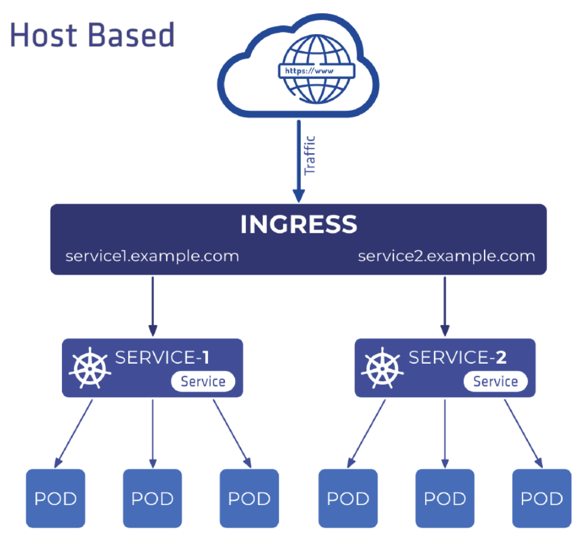

#### plik konfiguracyjny - ConfigMap

Odwolanie sie innym pliku (deployment) do zawartosci ConfigMap.

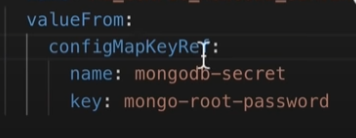

#### plik konfiguracyjny - PersistentVolume (pv) i PersistentVolumeClaim (pvc)

Pvc jest dodatkową warstwa abstrakcji. Podpinam pod nia aplikacje i ogolnie definiuje np. jakiej pojemnosci pamieci potrzebuje. Kubernetes dalej znajdzie mi odpowienii pv sposrod tych pv ktore sa podpiete pod dany pvc.

UWga - *pod* i *pvc* musza byc w tym samym Namespace. Natomiast *pv* nie sa przypisywane do NameSpace.

Konfiguracja pv pod local storage:

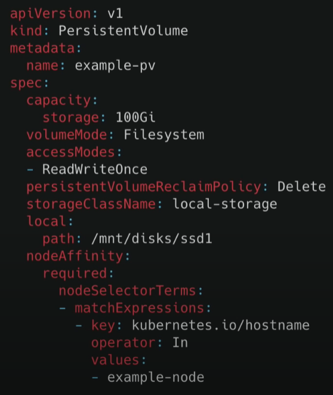{width="375"}

Konfiguracja pv pod nfs:

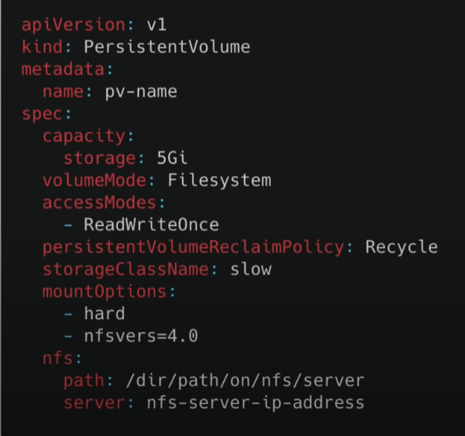{width="375"}

Konfiguracja pv pod Google Cloud:

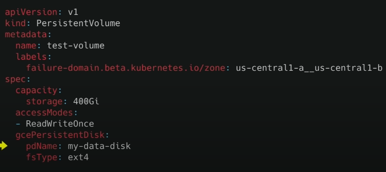

Przyklad konfiguracji pod (pytanie co z Deployment???) i pvc (mountPath w *pod* to sciezka w podzie pod ktora jest podczeiony *Volume*. Nie jest to sciezka samego *Volume*:

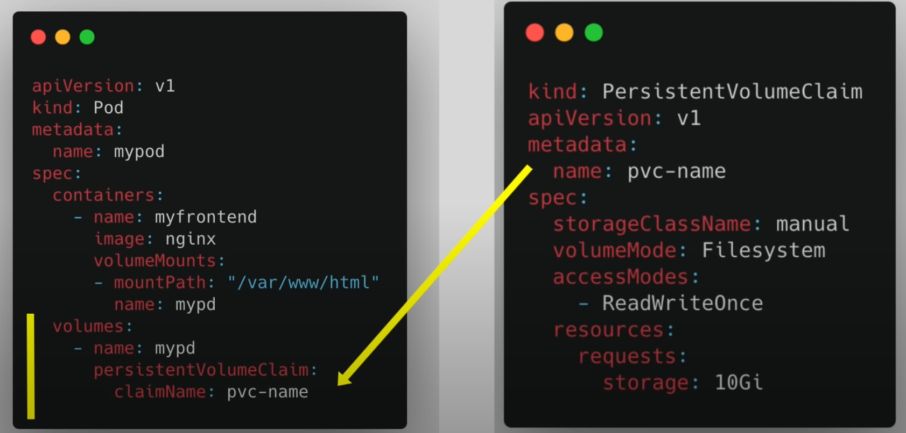

#### plik konfiguracyjny - Job

Job

### Health check

Sa 3 typy checkow.

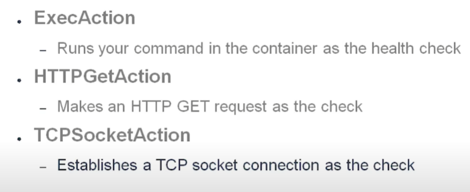

Przyklad dla ExecAction:

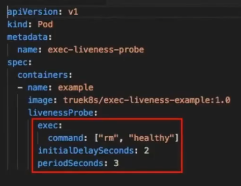

### Namespace

Nowe Namespace tworzy sie kiedy mamy dużo aplikacji. Domyslnie istnieje tzw. 'default' NameSpace.

Kazdy *Namespace* musi miec swoj *ConfiMap*.

To do jakiej *Namespace* nalezy element najlepiej sparametryzowac w plikach konfiguracyjnych.

Istnieje mozliwosc odwolywanie sie pomiedzy namespace. Sluzy do tego nazwa Namespace po kropce za nawa elementu.

Kiedy tworzymy *Namespacy* nie wszyskie elementy musza sie w nich znajmowac. Czesc moze byc dalej po prostu w Default Namespace.

### Volumes

Volumens rowniez konfiguruje sie w plikach konfiguracyjnych. Dlatego odsylam to do odpowiednich podrozdzialow tego manuala.

Dodatkowo nalezy pamietac ze istnieje mozliwosc powolywania volumes wewnatrz pod-a do komunikacji miedzy kontenerami w pod-ie. Wystaraczy to skonfigurowac w plikach konfiguracyjnych samych pod-ow:

<https://kubernetes.io/docs/tasks/configure-pod-container/configure-volume-storage/>

```{r}
apiVersion: v1
kind: Pod  # pytanie co z Deployment ???
metadata:
  name: redis
spec:
  containers:
  - name: redis
    image: redis
    volumeMounts:
    - name: redis-storage
      mountPath: /data/redis
  volumes:
  - name: redis-storage
    emptyDir: {}
```

Uwaga: technicznie ConfigMap i Secret to local Volumes.

### Helm

Narzedzie do zarzadzania wszyskimi plikami konfiguracyjnymi.

W ramach niego powstaje tzw. Helm Chart okreslajacy strukture plikow konfiguracyjnych. Ulatwia to wspoldzieleniem sie naszymi rozwiazaniami z innymi. Są nawet puliczne Hub-y z Helm-ami

W templetach helmowych jest duzo curly brackets.

FIlmik: [link](https://www.youtube.com/watch?v=5_J7RWLLVeQ)

Opis czym sa

[link](https://helm.sh/docs/howto/charts_tips_and_tricks/)

Lista elementow ktore mozna wykorzystac:

[link](https://hub.kubeapps.com/charts/bitnami/common/1.3.8)

### Dashboard

[link](https://kubernetes.io/docs/tasks/access-application-cluster/web-ui-dashboard/)

[link](https://www.replex.io/blog/how-to-install-access-and-add-heapster-metrics-to-the-kubernetes-dashboard)

```{r}

kubectl apply -f https://raw.githubusercontent.com/kubernetes/dashboard/v2.2.0/aio/deploy/recommended.yaml

kubectl create serviceaccount dashboard-admin-sa

kubectl create clusterrolebinding dashboard-admin-sa --clusterrole=cluster-admin --serviceaccount=default:dashboard-admin-sa

kubectl get secrets

kubectl describe secret dashboard-admin-sa-token-….. # tutaj nazwa odpowiedniego tokena wyswietlonego przez 'kubectl get secrets'

kubectl proxy

```

Aktualny token:

eyJhbGciOiJSUzI1NiIsImtpZCI6IldMajNwcFJOemoyNkNFVmctVmZDRWN6YzRDWGpaZGJRVlN2djgyX2pTRWcifQ.eyJpc3MiOiJrdWJlcm5ldGVzL3NlcnZpY2VhY2NvdW50Iiwia3ViZXJuZXRlcy5pby9zZXJ2aWNlYWNjb3VudC9uYW1lc3BhY2UiOiJkZWZhdWx0Iiwia3ViZXJuZXRlcy5pby9zZXJ2aWNlYWNjb3VudC9zZWNyZXQubmFtZSI6ImRhc2hib2FyZC1hZG1pbi1zYS10b2tlbi16enh6dCIsImt1YmVybmV0ZXMuaW8vc2VydmljZWFjY291bnQvc2VydmljZS1hY2NvdW50Lm5hbWUiOiJkYXNoYm9hcmQtYWRtaW4tc2EiLCJrdWJlcm5ldGVzLmlvL3NlcnZpY2VhY2NvdW50L3NlcnZpY2UtYWNjb3VudC51aWQiOiI3YTYzZTgwZC1iYTEyLTQ5NzMtYmEwMC1lNGI4MDFhZjJhNmQiLCJzdWIiOiJzeXN0ZW06c2VydmljZWFjY291bnQ6ZGVmYXVsdDpkYXNoYm9hcmQtYWRtaW4tc2EifQ.QlORaTfP7kJ8vIbx2XeMl2z93oPzWiyGEG4db7hzZ-PldnyLhuuKcV4LSDkKQFjpv_ihuzDgeXlgO1LVAxGQibIk7bG5x2hwGG-5d8JkE0Wkbwjfte3eiEUGsJ6kULeyq7NinNrFhJE0u2IGWQq-xIr-hpxtLvZ7dvEY2LM4xc1dV72NnRqV0tiaTTTAMK3h_Jo9y5_nsMlD1JloeL_XCZOZQE_SxNXdBnTBgaGtGQw9NH3pMiA135CCnUsJ2XqCFDSqsBRjVuV_FCD8KFKH1cxrK9LMornz1_nzNUyic73MwxeGRTT_C1GsfsqAtxQ6QVEl7GyWrR0yHatN76Lebw

dashboard bedzie dostepny pod strona: <http://localhost:8001/api/v1/namespaces/kubernetes-dashboard/services/https:kubernetes-dashboard:/proxy/>

## Virtual OS - Dockers

### Rozne uwagi

-   Dockery wirtualizuja system operacyjny, ale tylko jego warstwe aplikacyjna bez warstwy kernala. Dlatego np.nie da się w prosty sposob odpalic kontenerow linuxowych na windows. Do tego musimy miec na Windowsie dodatkowe komponenty ktore to umozliwia.
-   Docker host odnosci sie nie do jakiego servera dockerowego, ale hosta czyli komputera na ktorym docker jest zainstalowany. Nalezy o tym pamietac przy ogladaniu rysunkow na ktorym jest uzywane to pojecie.

### Instalacja

#### Windows

[link](https://www.youtube.com/watch?v=3c-iBn73dDE&t=240s) (30:22)

##### Wymagania wstepne

Windows 10 w wersji home nie zawiera niezbędnego *hyper-v*. Ale można to jakość obejść.

Sprawdzanie czy mamy *hyper-v* i czy jest włączony:

start -\> aplikacje i funkcje -\> kolejno zamazane na zółto elementy na screenie:

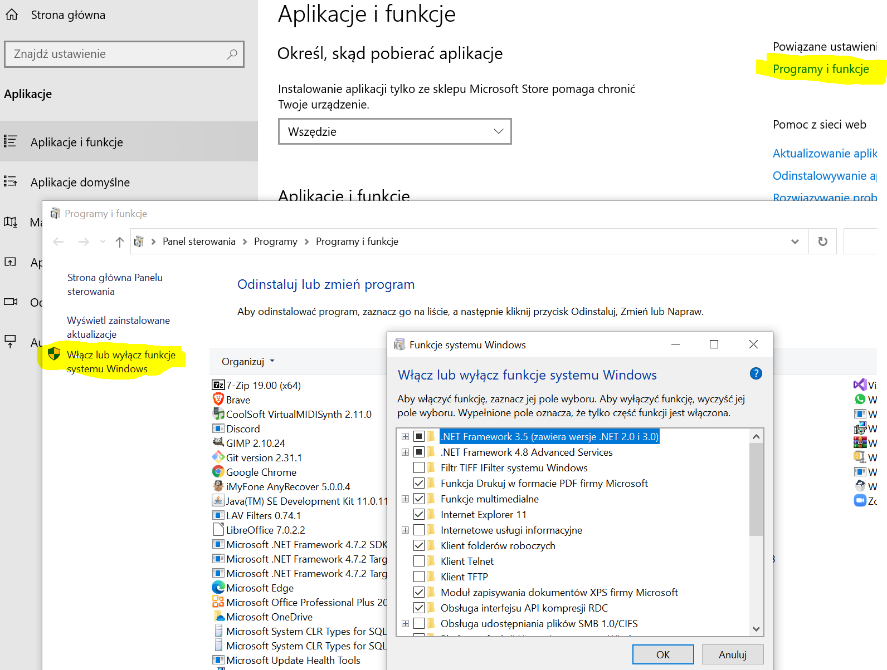

#### Ubuntu

[link](https://docs.docker.com/engine/install/ubuntu/)

### Docker

```{r}

# Wersja dockera enginee. 
sudo docker version

# szczegolowe informacje o dockerze
sudo docker info

# Status dockera
sudo service docker status

# Restartowanie dockera
sudo service docker restart


```

### Images

```{r}

# lista obrazow na dokerze
sudo docker images

# szczegolowe informacj o obrazie
sudo docker image rm --force  <nazwa_obrazu>


# usuniecie obrazu (nie kontenera!!!)
sudo docker image rm <nazwa_obrazu>
  
# usuniecie obrazu (nie kontenera!!!) w wymuszeniem w przypadku problemow
sudo docker image rm --force  <nazwa_obrazu>
  
# wyszukiwanie obrazow zawierajacy okreslana fraze
sudo docker search <fraza>
  
# pobranie obrazu z repozytorium
sudo docker pull <obraz>
  
# pobranie obrazu z podaniem wersji (bez podania wersji jest pobierany najnowsza)
sudo docker pull <obraz:wersja>

```

#### Warstwy

Obrazy skladaja sie z warstw. Mozna je porownac go Git-owych commitow gdzie kolejne commity dokladaja kolejne zmiany.

Obraz pobierany jest kolejnymi warstwami: to widać poniżej (kolejne hashe to kolejne warstwy).

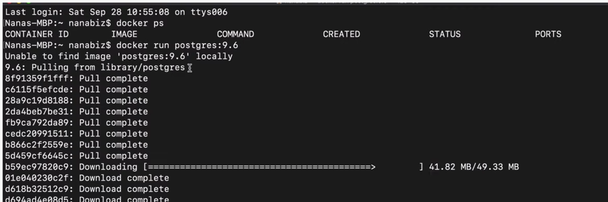

Kiedy pobierany nowszą wersję tego samego obrazu podmieniane są tylko te warstwy które się zmieniły.

Najniższą (bazową) warstwą jest zazwyczaj system operacyjny. Najczęściej jest to linux. Dodatkowo zalecana jest jego lekka wersja o nazwie *alpine*.

Ubuntu domyslnie trzyma obrazy w lokalizacji:

`/var/lib/docker/`

### 

### Kontenery

Uwaga: nazwa obrazow i kontenera to nie to samo. Nazwy kontenerow sa tworzone dynamicznie (po polceniu *create* lub *run*) i roznia od nazw obrazow jezeli ich recznie nie ustawimy.

```{r}

# dodanie do obrazu warstwy kontenera i tym samym utworzenie go (kontenera)
sudo docker create <image_name>

# uruchomienie kontenera
sudo docker start <container_name> # pamietajmy: nazwa kontenera a nie obrazu
  
# run = create + start

# utworzenie wartwy na obrazie kontenera oraz uruchomienie kontenera w trybie interaktywnym (attach)
sudo docker run -i <image_name>
  
# utworzenie wartwy na obrazie kontenera oraz uruchomienie kontenera w trybie interaktywnym (detach)
sudo docker run -d <image_name>

# uruchomienie dockera z wyborem, shella (tuta przyklad z bash-em)
sudo docker run <image_name> /bin/bash  # /bin/sh dla sh

# wiecej o patametrach 'run':
# https://docs.docker.com/engine/reference/commandline/run//

# wyjscie z kontenera w ktorym jestesmy  i zatrzymanie jego pracy
exit

# wyjscie z kontenera bez jego ubijania (detach)
ctrl+p+q

# wejscie do dzialajacego kontenera (attach). Warto porownac z komenda 'docker exec'
sudo attach <container_name>
  

# uruchomienie kontenera bez wchodzenia do niego (tryb detach)
sudo run -d <image_name>
  
# co wyzej w recznym wyspecyfikowaniem nazwy powstajacego kontenera
sudo run -d --name <container_name> <image_name>

# lista uruchomomionych kontenerow (ich nazwy sa wkolumnie 'NAMES' na koncu)
sudo docker ps

# lista wszyskich kontenerow
sudo docker ps -a

# lista zatrzymanych kontenerow
sudo docker ps -aq 

# zamkniecie kontenera z zewnatrz
sudo docker stop <container_name>

# ubicie kontenera - bo np. jest zawieszony
sudo docker kill <container_name>

# zapauzowanie kontenera
sudo docker pause  <container_name>

# odpauzowanie kontenera
sudo docker unpause  <container_name>
  
# usuniecie kontenera (nie bedzie go juz na liście uzyskanej z  'docker ps -a')
sudo docker rm <containar_name>
  
  
# usuniecie wszyskich niewlaczonych kontenerow
sudo docker container prune 
#lub
sudo docker rm $(sudo docker ps -aq)


# logi kontenera
sudo docker logs <container_name>


# uruchomienie z okreslona siecia
sudo docker run --net <nazwa_sieci> <nazwa_obrazu>
  
# uruchomienie z 


```

Sledzenie zmian w kontenerze

```{r}

# jakie pliki/katalogi zostaly zmodyfikowane
sudo docker diff <container_name>
 
```

#### Inspekcja

Szczegolowe informacje o tym co sie dzieje z danym kontenerem

`sudo docker inspect <container_name>`

#### attach vs exec

Attach:

Po prostu umozliwia nam podpiecie sie terminalem pod kontener i tym samym prace z nim w inteaktywnym trybie (przez ten terminal).

Exec:

Docker exec executes a new command / create a new process in the container's environmen.

Ponizsze uzycie *exec* daje podobny efekt co *attach (-it od interactive terminal)*

`sudo docker exec -it <caontainer_name> /bin/bash`

#### O outpucie *docker ps*

```{r}

$ docker ps
CONTAINER ID      IMAGE      COMMAND        CREATED           STATUS
f0c9cd92a938      ubuntu     "sleep 60"     3 seconds ago     Up 1 second

```

Powyzej *COMMAND* oznacza:

It's the command passed to `docker run <image> [command]`. If no command was specified there then it's the `CMD` from the Dockerfile. In [`ubuntu`'s case](https://github.com/tianon/docker-brew-ubuntu-core/blob/857debd4347496c541f9806c084710dace49cd27/bionic/Dockerfile) that would be `CMD ["/bin/bash"]`

#### Zmienne srodowiskowe

Uruchamianie kontenera ze zmiennymi srodowiskowymi poprzez operator *-e*.

Additionally, the operator can **set any environment variable** in the container by using one or more `-e` flags, even overriding those mentioned above, or already defined by the developer with a Dockerfile `ENV`. If the operator names an environment variable without specifying a value, then the current value of the named variable is propagated into the container's environment:

`docker run -e "deep=purple" -e today`

### Tworzenie obrazu

#### Przez commity

#### Przez Dockerfile

COPY - kopiowanie spoza kontenera do kontenera.

RUN - komendy odpalane w czasie budowy obrazu. Sa wykonywane wewnatrz kontenera.

ENTRYPOINT - komendy odpalane za każdym razem po uruchomieniu kontenera (wykonywane sa w kontenerze)

CMD - komenda uruchamiana przy starcie kontenera (zawsze jedna). Przydaje się do kontenerow typu 'executable' , czyli np. uruchamiajac kontener tak naprawde od razu odpalam jakas aplikacje ktora jest w nim.

ENV - s

BUdowanie kontenera:

```{r}
docker build -t <nazwa:numer_versji>
```

### Networking

#### Ogolen info

Docker domyslnie tworzy dla kontenerow 3 sieci.

-   bridge - sluzy glownie do komunikacji miedzy kontenerami.

-   host -

-   null - konener nie jest podlaczony do zadnej sieci

Lista sieci dockera:

`docker network ls`

Bridge:

Sluzy glownie do komunikacji miedzy konenerami. Kazdy kotener ma tutaj nadane swoje IP (niepowidzne poza siecia ??? Chyba z poziomu hosta mamy do nich dostep: patrz ksiazka o dockerach s.117 ). Bodatkowo docker0 (mostek) tez ma nadane IP. Ponizej mamy 2 kontenery i doecker0 (na rysunku jeszcze jest pokazane dodatkowo bindowanie portow na zewnatrz do kumunikacji ze swiatem zewnetrznym, ale o tym w innym rozdziale)

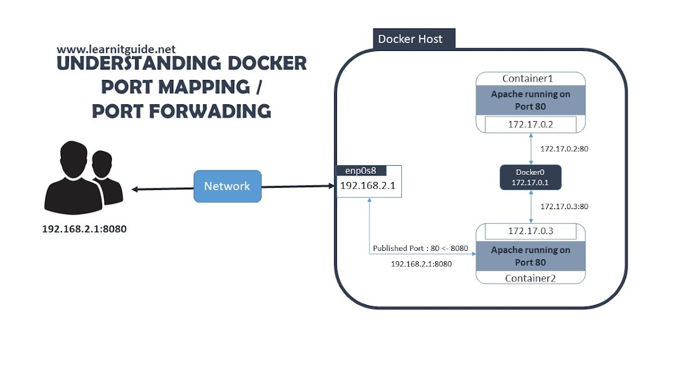

Mozemy utworzyc wiele sieci typu *bridge.* Jest zalecane aby do swoich projektow tworzyc wlasne sieci *bridge* niezalezne od tej domyslnej.

Szczegolowe informacje o konkretnej sieci

`sudo docker network inspect <nazwa sieci>`

#### Komunikacja miedzy kontenerami

Do komunikcji miedzy kontenerami mozemy uzywam wspomnianej sieci typu *bridge*, oraz wystawianych poza kontener katalogow poprzez jeden z dwoch mechanizmow:

-   volumne

-   bind mount

#### Komunikacja miedzy sieciami w dokerze

#### Komunikacja ze swiatem zewnetrznym

Kontenery nie są domyslnie dostepne z zewnatrz.

##### Bindowanie katalogow

Mozemy je skomunikowac ze swiatem zewnetrznym poprzez spiecie katalogu dockera z katalogiem na hoscie (*Volumes*):

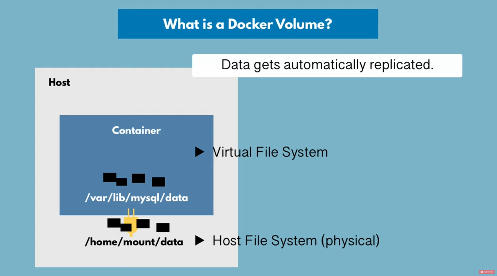

Sa 3 rodzaje *Volumes*:

-   **Host volumnes (Bind mount)**: reczne mapowanie katalogu z hosta na katalog z kontenera

-   **Anonymous volumes**: okreslam katalog w kontenerze, a na hoscie automatycznie docker robi sobie swoja lokalizacje (nie jest ona chyba bezposrednio dostepna. Docker sam sobie tym zarzadza).

-   **Named volumnes**: to co powyzej, ale dodatkowo okreslam nazwe, do ktorej moge sie potem odnosic (zalecany sposob pracy z *Volume*). Nazwa odnosci sie do folderu na hoscie.

*Anonymous volues* i *named volumes* sa zazwyczaj domyslnie tworzone w takich lokalizacjach:

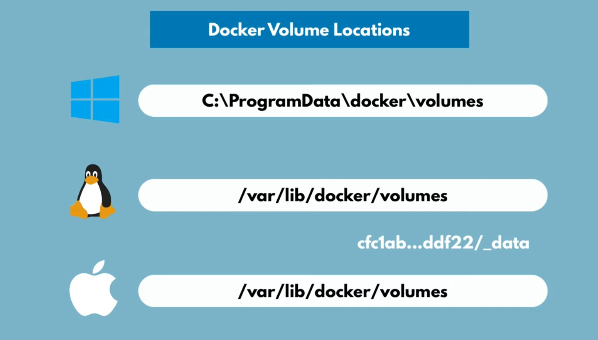

W tych katalogach kazdy volumen na swoj indywidualny hash.

*Volumes* to byty niezalezne od kontenerow. Usuwajac kontener nie usuwamy razem z nim automatycznie *volume*.

Polecenia

```{r}

# lista volumes
docker volume ls

# lista filtrowana po nazwie volumne
docker volume ls -f name=data

# inspecja
docker volume inspect <nazwa_volume>
  
  
# usuwanie
docker volume rm <nazwa_volume>
  
  
# usuwanie volumow nie uzywanych (nie spietych z zadnym kontenerem)
docker volume prune


# utworzenie volume nie podpietego pod kontener (named volume)
docker volume create <nazwa_volume>

# podpiecie istaniejacego volume pod kontener
docker run --mount source=[volume_name],destination=[path_in_container] [docker_image]


# utworzenie volumen typu host volume przez polecenie run (mount point jest tutaj w pwd)
docker run -v $(pwd):/var/opt/project <image_name>
  

# podpiecie kontenera do voluma innego kontenera
docker run --volumes-from <nazwa_kontera_do_volume_ktore_sie_podpinamy> <nazwa_obrazu>

  
```

W ramach *volume* *mountpoint* dotyczy katalogu po stronie hosta a nie kontenera.

##### Porty

Mozemy tez dokonac bindowania portow kontenera z portami komputera.

Kontenery otwieraja sie domylsnie na okreslonych portach.

Sprawdzenie jaki port ma wystawiony kontener.

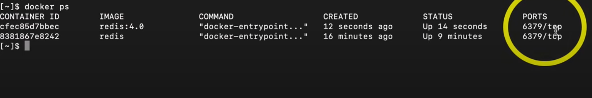

Aby kontener miał komunikację ze swiatem zewnętrznym (poza calym Docker Hostem) musimy zbindowac porty kontenera z portami komputera. Jednak dwa kontenery moga wpasc w konflikt bo otworza sie na tych samych portach:

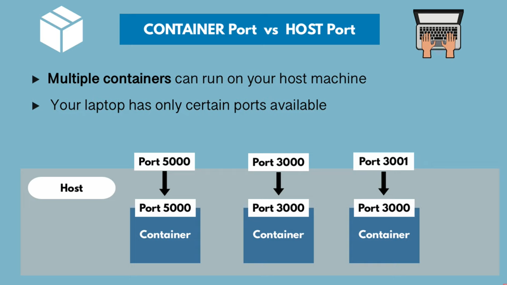

Bindowanie okresla sie np. w poleceniu run:

```{r}
# zbindowanie portu 6379 kontenera na port 6000 komputera
dockeer run -p6000:6379 <image_name>


```

Potem informacja o tym bindowania moze byc wyswietlona w kolumnie *PORTS* po wywołaniu `docker ps:`

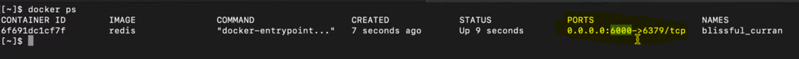

### Compose

Zapisywanie do pliku yaml listy komend ktore uruchamiaja nam kontenery z odpowiednimi ustawieniami.

Przyklad przepisanie komend na yamla:

KOMENDY:

```{r}

docker run -d \
  --network todo-app --network-alias mysql \
  -v todo-mysql-data:/var/lib/mysql \
  -e MYSQL_ROOT_PASSWORD=secret \
  -e MYSQL_DATABASE=todos \
  mysql:5.7

```

odpowiadajacy komendom YAML:

```{r}

 version: "3.7"

 services:
   app:
     # The app service definition
   mysql:
     image: mysql:5.7
     volumes:
       - todo-mysql-data:/var/lib/mysql
     environment:
       MYSQL_ROOT_PASSWORD: secret
       MYSQL_DATABASE: todos

 volumes:
   todo-mysql-data:

```

Wiekszy przyklad: <https://docs.docker.com/get-started/08_using_compose/>

Odpalanie pliku compose:

Trzeba sie upewnic ze mamy zainstalowane *Docker compose*. Jezeli tak wykonyjemy komende:

`docker-compose -f <nazwa_pliku_yaml> up`

### Uprodukcyjnianie

#### Docker Hub.

Na *Docker Hub* jest duzo dodatkowych uzytecznych informacji o obraza jak np. informacje o konfiguracji zmiennych srodowiskowych. Warto je poczytac.

#### Proces uprodukcyjniania

Ponizej:

1.  Developuje sobie moja apke. Jenym z jej elementow moze byc kontener (bazowy pobieram sobie np. z Docker hub).
2.  Caly moj projekt wrzucam na Git
3.  Potem Jenkins przygotowuje paczke. W jego ramach musi sie tez zajac naszym kontenerem. Musi utworzyc obraz w oparciu o nasz Dockerfile i potem go umiescic na Repozytorium.
4.  Na koniec jest przeprowadzana instacja na serverze. W ramach instalacji nasz obraz bedzie mogl byc pobrany z repozytorium.

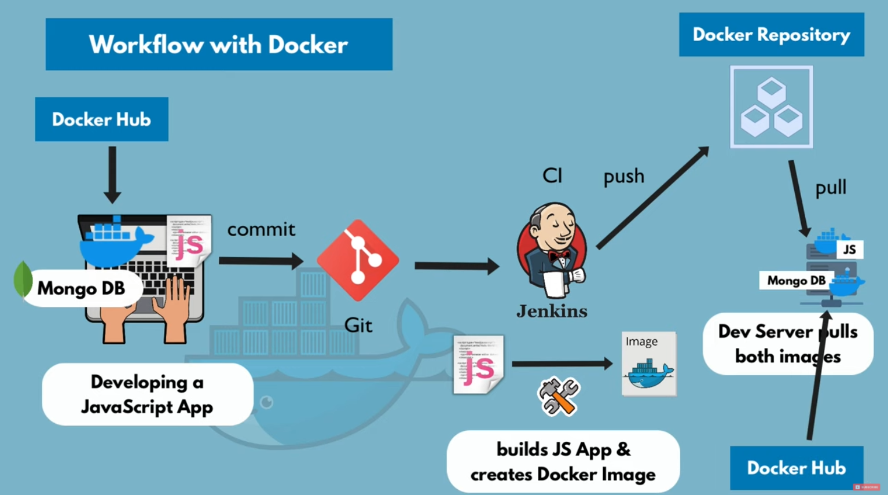

## Virtual OS - Other Solutions
