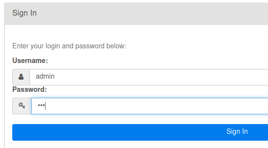

# Workflow

## AirFlow

### Instalacja - Ubuntu

Przetestowane dla Airflow 2.12 i ubuntu 21.04 i Pythona 3.95. Uwaga na
wirtualnej maszynie jest problem z wielowątkowością. Dlatego nie można
przy bazie SQLite puścić jednocześniej schedulera i webserwer.

-   Tworze katalog pod airflow (np. /home/Moje_zasoby/Airflow)

-   W tym katalogu tworze venv-a Pythonowego.

-   Bedac z tym katalogu aktywuje venv-a (source venv/bin/activate)

-   Tworze zmienna srodowiskowa `export AIRFLOW_HOME=$(pwd)`

-   Tworze katalog pod DAG-s: `mkdir -p ${AIRFLOW_HOME}/dags/`

-   Instaluje airflow `pip install apache-airflow`

-   Inicjuje baze danych `airflow db init` (domyslnie bedzie to sqlite)

-   Tworze uzytkownika 'admin':
    `airflow users create --username admin --firstname lucas --lastname musz --role Admin --email memy@wp.pl`
    Po wpisaniu powyzszej komendy bedziemy poproszeni o podanie hasla.

-   Uruchamiam w trybie detached:

        airflow kerberos -D
        airflow scheduler -D
        airflow webserver -D

    Uwaga. Mialem problem ze w trybie -D werserver nie wspolpracowal z
    przegladarka. Wtedy w ostatnim poleceniu mozemy dac po prostu
    `airflow webserver`

    Domyslnie powinien sie uruchomic na adresie:
    [\<http://localhost:8080/\>](http://localhost:8080/){.uri}:
    

### Instalacja - Windows

Chyba najlepiej do przez Dockera zrobić.

### Składnia

dobry tutorial:
[link](https://airflow.apache.org/docs/apache-airflow/stable/tutorial.html)

Uwag:

-   w skladni uzywane sa nawiasy `{{...}}` . Jest to zwiazane ze
    skladnia Jinja.

-   sa 2 posoby definiowania zaleznosci miedzy procesami:

    -   t1.set_downstream(t2)

    -   t1 \>\> t2

### Komendy CLI (**Command Line Interface**)

airlow db init - inicjowanie bazy danych. Wykonujemy tylko raz.

airflow dags list - lista dag-ow

airflow tasks list \<nazwa_daga\> - lista taskwo w konkretnym DAG-u.

airflow dags trigger -e 2020-01-01 \<nazwa daga\> - uruchomienie
konkretnego DAG-a.

airflow tasks test \<dag_id\> \<task_id\> - testownie taskow

Różne:

Jak działa parametr catchup:
[link](https://medium.com/nerd-for-tech/airflow-catchup-backfill-demystified-355def1b6f92)
